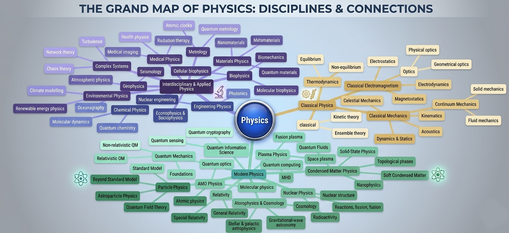

# The Grand Map of Physics

*A visualization of physics sub-disciplines and their relationships – from classical foundations to modern frontiers.*

## Overview

This repository hosts a detailed map that organizes the vast landscape of
physics. The diagram captures major branches (classical physics, quantum
mechanics, relativity, astrophysics, nuclear & particle physics) and their
overlapping territories, as well as more specialised fields like biophysics,
nanotechnology, and health physics.

## Legend (based on line types in the image)

| Line Style         | Meaning                                                                 |
|--------------------|-------------------------------------------------------------------------|
| **Green solid**    | Core classical relationships (e.g., mechanics ↔ electromagnetism)       |
| **Blue dashed**    | Quantum / modern connections (e.g., quantum information ↔ condensed matter) |
| **Red dotted**     | Applied or cross‑disciplinary links (e.g., health physics ↔ radiation therapy) |
| **Yellow grey dashed** | Emerging or tentative influences (e.g., metamaterials ↔ nanoelectronics) |

## Disciplines & Subfields Featured

### Classical Physics
- Classical Electromagnetism • Electrostatics • Optics • Geometrical optics • Classical Electrodynamics
- Solid mechanics • Magnetostatics • Kinematics • Fluid mechanics • Acoustics • Dynamics & statics

### Quantum Physics
- Quantum information science • Quantum fluids • Quantum metrology • Quantum sensing
- Quantum computing • Quantum chemistry • Non‑relativistic QM • Relativistic QM • Quantum field theory
- Soft condensed matter • Nanophysics • Topological phases

### Nuclear & Particle Physics
- Nuclear structure • Reactions (fission/fusion) • Particle physics • Standard Model
- Beyond Standard Model • Astroparticle physics

### Relativity & Astrophysics
- Special relativity • General relativity • Stellar & galactic astrophysics
- Gravitational‑wave astronomy • Space plasma

### Applied & Interdisciplinary
- Health physics • Radiation therapy • Atomic clocks • Nanomaterials • Metamaterials
- Nanoelectronics • Biomechanics • Turbulence • Equilibrium

## License

The content of this repository is made available under the [Creative Commons
Attribution‑ShareAlike 4.0 International
License](https://creativecommons.org/licenses/by-sa/4.0/) (CC BY‑SA 4.0). You
are free to share and adapt the map as long as you give appropriate credit and
distribute any derivative works under the same license.
